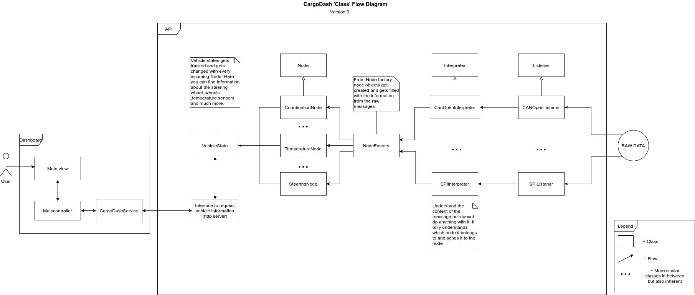

# CargoDash Usage Guide
This document will help you to understand how to make use of CargoDash. CargoDash is a diagnostics tool for developing autonomous vehicles and is written in Python code (version 3.8.5). For any questions please feel free to create an issue.

## Python Dependencies
```
    aiohttp v3.7.3
    can v3.3.4
    canopen v1.1.0
    numpy v1.19.4
    pyyaml v5.3.1
```
## Installation
1. Clone the repository
```
    git clone https://github.com/ZeroPoint095/CargoDash
```
2. Install the Python dependencies with pip3
```
    pip3 install -r requirements.txt
```
3. Run startup.sh to use CargoDash
```
    ./startup.sh
```  

## Introduction
CargoDash is a tool that listens to incoming messages and sets the values of these messages into user-defined nodes. These user-defined nodes can be requested with CargoDash's HTTP-server. Besides this, it logs all raw incoming messages into a buffered logger. 

For now, CargoDash works only with CanOpen messages but with the architecture of CargoDash, you should be able to add your desired message protocol.

The buffered logger can be requested to log all messages from the buffer on command. The buffer is circular and records the messages continuously. When the buffer is full then it continues by overwriting the oldest messages.  For example, when the buffer just filled in index 1024 and it has a range from index 0 to index 1024 then it starts over again from index 0. The buffer gets filled from 0 to 1024 again. The logger has many useful purposes. You can request the buffer on a dangerous event or just when a user wants to see the log.

## Our usage
We created CargoDash to listen to a CanOpen network and use it for the Smarterdam project. The Smarterdam project is funded by Rotterdam University of Applied Sciences. CargoDash is able to track all incoming CanOpen messages and we are able to give more meaning to messages that have been send and received.

In our application, we created a network of Arduino's that communicate with a Raspberry Pi running the CargoDash code. For the communication between the Arduino's and the Raspberry Pi, we created a can bus network. All these micro-controllers are communicating with the CanOpen protocol. For the Arduino's to communicate in CanOpen, we forked [jgeisler0303's](https://github.com/jgeisler0303/CANFestivino) repository. We fixed some bugs and adapted it more to our use case. Our repository can be found [here](https://github.com/ZeroPoint095/CANFestivino).

## Using the configuration file for CanOpen (config.yaml)

Inside the code block below you can read a detailed description of which configurations that CargoDash uses. In general, we prefer that CargoDash can be configured from one file such as the config.yaml file instead of multiple configuration places. This makes CargoDash more user-friendly and centralized. 
```yaml
    # canopen_vcan is a configuration example for the CanOpen protocol.
    # With a similar pattern you can create multiple canopen configurations.
    # For now we use canopen_vcan as example. All these paramters inside canopen_vcan 
    # are used for CargoDash's CanOpen implementation.
    canopen_vcan:
        
        # Sets the bustype of the CanOpen network. 
        bustype: socketcan 
        
        # Sets the channel name of the CanOpen network
        channel: vcan0 
        
        # Sets the bitrate of CanOpen the network
        bitrate: 500000 
        
        # Sets the nodes which exist inside the network.
        # This is done in an array with object that contain information needed for CargoDash.
        # Every object needs to contain these attributes
        #       local : sets if the node is either remote or local
        #       eds_location : path to the eds file of the node
        #       node_purpose : object containing name and type of node:
        #                      name: Short description of the node
        #                      type: integer that should reflect the types of the nodes 
        #                            at node_input_factory/node_input_enums.
        #       For example the node_purpose type below is 0 and that is reflected with a
        #       DistanceNode.

        nodes: [{local: false, eds_location: 'eds_files/Arduino1.eds', node_purpose: {name: 'Front view object distance', type: 0}}]
        
        # Sets the max speed of wheelNodes.
        max_speed_in_ms: 3 
        
        # Object related to can data logging.
        # Our logger makes use of a buffered logger implementation.

        raw_can_data_logging: {
            # Enables of Disables the buffered logger.
            enabled: true,

            # The size of the buffer so with it can contain 1024 can messages.
            buffer: 1024
        }
```
## Extending CargoDash Communication Possibilities

For now, CargoDash is only able to work with the CanOpen protocol but it has the potential to work with more communication protocols. If you want to add a communication protocol then you should add a new interpreter and a new listener. You can easily create a new listener class that uses the same methods as the abstract listener class. The same goes for the interpreter. It's important that you create nodes from the NodeFactory inside your interpreter. The NodeFactory class creates 'Node Input' objects which can be used to change the vehicle's state. In the diagram below you can have an understanding of CargoDash internal class interaction works.




## Adding Nodes
In CargoDash we already implemented certain standard nodes that would exist in a real vehicle such as SteeringNode, TemperatureNode, and more. But if you want to add your own, custom node you can add it by changing some files. You can do this using the changes described below using a LidarNode as an example.

Just add an enum to the enums list.
```python
    # Add to: node_input_factory/node_input_enums.py

    ...
    LidarNode=5
```

At the end of the file add the new class *LidarNodeInput*.
```python
    # Add to: node_input_factory/node_input_classes.py

    ...
    class LidarNodeInput(NodeInput):
    # Enum 5
    def __init__(self, distance: float, name: str, node_name: str):
        super().__init__(distance, name, node_name)

```

Inside the class *NodeInputFactory* add a new method.
```python
    # Add to: node_input_factory/node_input_factory.py

    ...
    def create_lidar_node_input(self, distance: float,
                                   name: str, node_name: str):
        return LidarNodeInput(distance,
                              name, node_name)
```
And don't forget to import *LidarNodeInput* at the *node_input_factory.py* file.

In class *CanOpenInterpreter* you need to add the node check between the last elif and else.
You should make it similar like this.
```python
    # Change in: interpreter/can_open_interpreter.py

    ...
    elif(NodeType.LidarNode == node_type):
        n_input = self.node_input_factory.create_lidar_node_input(
            unpack('h', value)[0], name, node_name)
    ...
```

In the constructor of class *ConfigureableVehicle* inside the file *vehicle_classes.py*, you should add a new property like:
```python
    # Add to: vehicle_state/vehicle_classes.py

    self.lidar_nodes = array([])
```
At the end of the file you should add:
```python
    # Add to: vehicle_state/vehicle_classes.py

    ...
    class LidarSensor(Node):
        def __init__(self, name):
            self.distance = 0
            super().__init__(name)

        def set_distance(self, distance):
            self.distance = distance
```
Then in private method *_add_node_to_vehicle* add:
```python
    # Add to: vehicle_state/vehicle_classes.py

    ...
    elif(node_type == NodeType.LidarNode):
        if(not self._is_node_existing(self.lidar_nodes,
                                        node_name)):
            new_node = LidarSensor(node_name)
            self.distance_nodes = append(
                self.distance_nodes, new_node)
    ...
```
Lastly you should add in method *edit_vehicle_state*:
```python
    # Add to: vehicle_state/vehicle_classes.py
    
    ...
    elif(input_type == LidarNodeInput):
        node = self._get_node(self.lidar_nodes, node_input)
        if(node is not None):
            node.set_distance(node_input.value)
    ...
```

## API

#TODO: create interface for API
