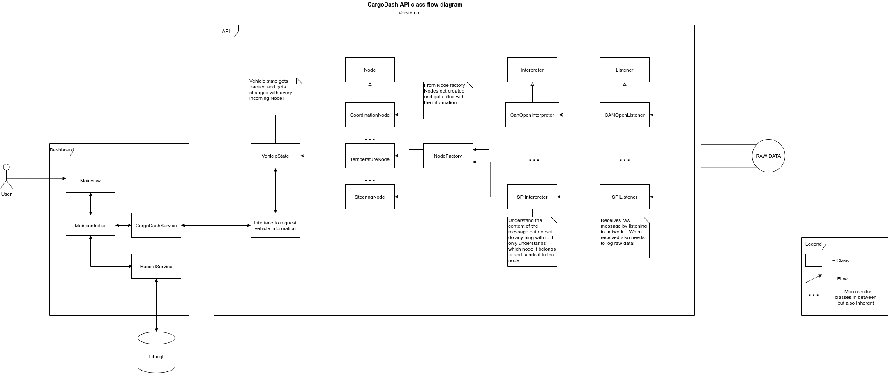

# CargoDash Usage Guide
This document will help you to understand to make use of CargoDash. CargoDash is written in Python code (version 3.8.5). For any questions please for free to create an issue. For this project we follow the SI standards.

## Requirements

    aiohttp v3.7.3
    can v3.3.4
    canopen v1.1.0
    numpy 1.19.4
    

## Introduction
CargoDash is a tool that listen to incoming messages and sets the values of these messages into user-defined nodes. The values of these nodes can be requested with CargoDash's API. Besides this it logs all raw incoming messages in a buffered logger. For now, CargoDash works only with CanOpen messages but with the structure of CargoDash you be able to add your desired message type. The logger can be requested to log all messages inside the buffer on command. For example, you can request the buffer on a dangerous event or when the user wants it.

## Our usage
We created CargoDash to listen to a CanOpen network and use it for the Smarterdam project. The Smarterdam project is funded by Rotterdam University of Applied Sciences. CargoDash is able to track all incoming can messages and we are able to give more meaning to messages that have been send and received.     

## Using the configuration file for CanOpen (config.yaml)

Inside the code block below you can see a detailed description for attribute that CargoDash uses.

    # canopen_vcan is a configuration and is a configuration example for CanOpen.
    # With a similar pattern you can create multiple canopen configurations.
    # For now we use canopen_vcan as example. All these paramters inside canopen_vcan are used for CargoDash's implementation.
    canopen_vcan:
        
        # Sets the bustype of the CanOpen network. 
        bustype: socketcan 
        
        # Sets the channel name of the CanOpen network
        channel: vcan0 
        
        # Sets the bitrate of CanOpen the network
        bitrate: 500000 
        
        # Sets the nodes which are existing inside the network.
        # This is done in an array with object that contain information needed for CargoDash.
        # Every object needs to contain these attributes
        #       local : sets if the node is either remote or local
        #       eds_location : sets the location of the needed eds file of the node
        #       node_purpose : object containing name and type of node:
        #                      name: Short description of the node
        #                      type: integer that should reflect the types of the nodes 
        #                            at node_input_factory/node_input_enums.
        #       For example the node_purpose type below is 0 and that is reflected with a
        #       DistanceNode.

        nodes: [{local: false, eds_location: 'eds_files/Arduino1.eds', node_purpose: {name: 'Front view object distance'
        , type: 0}}]
        
        # Sets the max speed of wheelNodes.
        max_speed_in_ms: 3 
        
        # Object related to can data logging.
        # Our logger makes use of a buffered logger implementation.

        raw_can_data_logging: {
            # Enables of Disables the buffered logger.
            enabled: true,

            # The size of the buffer so with it can contain 1024 can messages.
            buffer: 1024
        }

## Extending CargoDash Communication Possibilities

## Adding Nodes

## API

#TODO: create interface for API